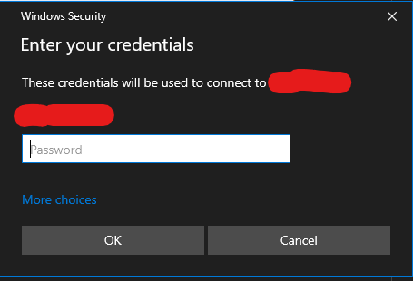

# RDP Protocol Handler
This simple app allows you to use `rdp://` uri to start remote desktop session. So you can use uri like this:

`rdp://full%20address=s:blah.blah&username=s:netbios%5Cdusername/`

and you will see Remote Desktop Connection window if you do not have saved credentials, a username hint does not preexist, and a username is not specified in the uri  otherwise you will be automatically be brought to a credential prompt with username filled in (when cached in username hints, or specified in url).

### [Release Notes and Download](https://github.com/SeSeKenny/RdpProtocolHandler/releases)

## How to install
### New method
Install MSI from release page

### Old method
Place the `.exe` file in desired location on your PC, then run it **as administrator** with `/install` parameter like this:

`rdpProtocoleHandler.exe /install`

After installation do not move the `.exe` file to other location. When you change the file location the protocol handler will not work until you run it again with `/install` parameter.

## How to use
Just open uri which start with `rdp://` using browser or any other way.

### Uri format
The uri format used by application has been modified from original project to suite the native rdp URI scheme Microsoft has published, but for whatever reason Windows was not included.

https://docs.microsoft.com/en-us/windows-server/remote/remote-desktop-services/clients/remote-desktop-uri

As of now only only 'full address', and 'username' have been implemented

Because Microsoft has decided not to update mstsc.exe to handle these things natively, the coding methods are described below.

"full address" = "/v blah.blah" passed as argument to mstsc.exe

"username" = parsed and sent to the per user registry keys that deal with username hints

## RDP Protocol Handler parameters
`rdpProtocoleHandler.exe [/install] [/uninstall] [/log] [/help] [/?]`

Parameter       | Description
 -------------- | ------------- 
 /install       | Run the installation procedure and register the rdp uri handler. **Require administration privileges**
 /uninstall     | Run the uninstallation procedure and unregister the rdp uri handler. **Require administration privileges**
 /log           | Open the log file
 /help          | Open the help
 /?             | Open the help

## Log file
The app logs its usages to file using [NLog](http://nlog-project.org). By default, log file is created in `C:\Users\<currentUser>\AppData\Local\Temp\rdppotocolhandler-logs`. You can change the logging behavior by creating the NLog.config file (for details go to NLog documentation). 

## Todo

- Program gateway and authentication usage parameters
- Sign MSI (money, money, money)

## Credit
Huge shoutout to original dev, original source found https://github.com/konradsikorski/RdpProtocolHandler/releases
